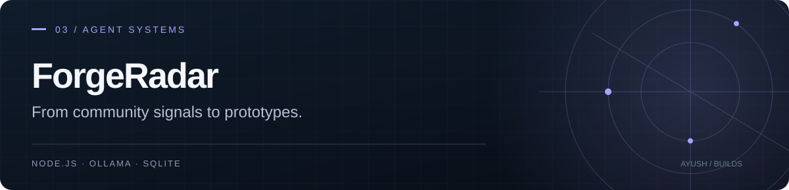

# ForgeRadar
### From community signals to a reviewable prototype.

A local-model workshop that gathers software ideas, evaluates supporting evidence, proposes a build, and creates a bounded prototype after approval. Each approved project can be synchronized to its own private GitHub repository.

**Node.js 24+ · Ollama · SQLite · Vanilla JavaScript**

## The workflow

```text
Scout → Miner → Evaluator → Critic → Proposal
                                      |
                                 Your approval
                                      |
                         Architect → Builder → QA → GitHub
```

Roles share one local model and run in sequence. The interface shows stage outputs, handoffs, and failures through server-sent events.

- **Discover:** collect public community signals and imported ideas.
- **Evaluate:** connect a proposal to evidence and check competing solutions.
- **Build:** generate an offline interface or a single-owner Node + SQLite data app.
- **Review:** inspect artifacts and acceptance checks before using the result.
- **Synchronize:** publish allowed source files to a separate private repository.

## Run locally

Install Node.js 24+, Git, and [Ollama](https://ollama.com/download), then download a suitable local model.

```sh
git clone https://github.com/AyushKJha/ForgeRadar.git
cd ForgeRadar
node server.mjs
```

Start Ollama before the server, then open http://127.0.0.1:4317. On Windows, `./start.ps1` provides a launcher. No npm packages are required.

Start with a small request such as **“Propose an offline reading-list organizer.”** Inspect the proposal, choose a build mode, and approve it.

## Supported build modes

| Mode | Output | Boundary |
| --- | --- | --- |
| Offline prototype | HTML, CSS, and JavaScript | Preview networking is disabled |
| Persistent application | Reviewed Node + SQLite runtime and generated data model | Single-owner CRUD, search, import, and export |

Custom backends, payments, third-party integrations, and multi-user roles are outside the builder's supported scope. Syntax and database checks do not prove that a generated product solves the intended problem.

## Sources and privacy

Adapters cover Hacker News, Reddit RSS, Stack Overflow, GitHub, and selected public social feeds. Availability and rate limits vary. X access is optional and disabled by default; Instagram supports imports rather than an automated crawler.

The local service binds to loopback. Keep credentials, runtime state, models, and generated databases outside the source repository. GitHub synchronization needs credentials with the appropriate repository permissions.

An optional hosted relay forwards work to the owner's running computer. It does not provide cloud model execution, durable cloud storage, or processing while the computer is off.

## Project map

| Path | Purpose |
| --- | --- |
| [orchestrator.mjs](orchestrator.mjs) | Role execution and artifact pipeline |
| [social-sources.mjs](social-sources.mjs) | Discovery adapters |
| [app-kit.mjs](app-kit.mjs) | Persistent app runtime |
| [public/](public/) | Workshop interface |
| [remote.mjs](remote.mjs) / [bridge.mjs](bridge.mjs) | Optional cloud-to-local relay |
| [AUDIT.md](AUDIT.md) | Existing audit notes |

## Validation

```sh
npm test
```

Tests include fixture-based orchestration, artifact checks, SQLite persistence, and relay behavior. A successful fixture run is separate from a live model mission. Idea scores are estimates, not evidence of market demand or originality.

See [OPERATIONS.md](OPERATIONS.md) for model setup, synchronization, startup supervision, automation, and relay details.
